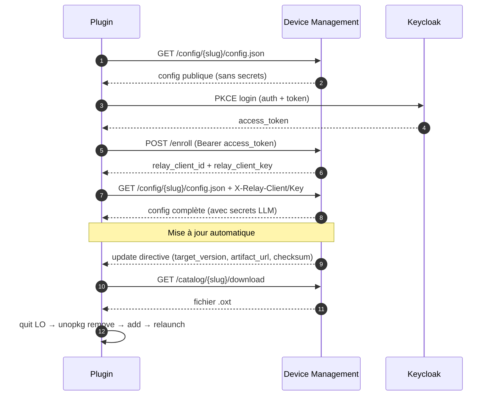

# MIrAI — Assistant LibreOffice

Extension LibreOffice intégrant un assistant IA directement dans Writer et Calc. Elle se connecte à un backend compatible OpenAI (OpenWebUI, Ollama, Scaleway, etc.) et inclut un mécanisme d'enrôlement via Device Management pour préconfigurer les URLs, tokens et modèles.

**Origine :** cette application est une version bêta développée dans le cadre du programme MIrAI du ministère de l'Intérieur. Elle s'appuie sur le travail de **John Balis**, auteur de l'extension [localwriter](https://github.com/balisujohn/localwriter), et sur des portions de code LibreOffice (MPL 2.0 — [gerrit.libreoffice.org](https://gerrit.libreoffice.org/c/core/+/159938)). Voir `registration/license.txt` pour les attributions complètes.

**Comparaison de modèles LLM :** une évaluation des modèles Scaleway sur les scénarios Writer (extension, résumé, reformulation) a été réalisée avec des textes issus de Wikipédia. Les résultats sont disponibles dans [bench/scaleway_model_comparison.md](bench/scaleway_model_comparison.md).

---

## Table des matières

- [Fonctionnalités Writer](#fonctionnalités-writer)
- [Fonctionnalités Calc](#fonctionnalités-calc)
- [Comportement général](#comportement-général)
- [Installation](#installation)
- [Déploiement et mises à jour](#déploiement-et-mises-à-jour)
- [Configuration](#configuration)
- [Structure du dépôt](#structure-du-dépôt)
- [Scripts de développement](#scripts-de-développement)
- [Télémétrie et monitoring](#télémétrie-et-monitoring)
- [Device Management et bootstrap](#device-management-et-bootstrap)
- [Historique des mises à jour](#historique-des-mises-à-jour)
- [License](#license)

---

## Fonctionnalités Writer

### ✏️ Modifier la sélection — `Ctrl+E`

Ouvre un dialogue avec des suggestions IA contextuelles. Saisir une instruction libre (traduction, reformulation, correction…) ou choisir une suggestion. Le résultat remplace la sélection. Filtrage automatique des blocs `<think>` (deepseek-r1).

### 📏 Ajuster la longueur — `Ctrl+J`

Mini-dialogue flottant avec boutons **−** (réduire ~35%) et **+** (développer ~40%). Remplacement en place, preview streaming, itératif.

### 📝 Résumer la sélection — `Ctrl+R`

Résumé concis inséré après la sélection avec délimiteurs.

### 💬 Reformuler la sélection — `Ctrl+L`

Reformulation en langage clair, insérée après la sélection avec délimiteurs.

### 📚 Documentation — menu MIrAI

Ouvre l'URL de documentation configurée via le bootstrap (`doc_url`).

---

## Fonctionnalités Calc

### 🔄 Transformer → colonne résultat — `Ctrl+T`

Applique une instruction sur une plage de cellules et écrit les résultats dans une colonne adjacente (non destructif).

### 🧮 Générer une formule — `Ctrl+G`

Génère une formule LibreOffice Calc à partir d'une description en langage naturel. Injecte automatiquement le contexte de la feuille (en-têtes, plage, valeurs). Boucle de correction si erreur.

### 📊 Analyser la plage — `Ctrl+K`

Analyse la plage sélectionnée et insère un résumé des tendances et anomalies sous la sélection.

---

## Comportement général

### Gestion des modèles

- **Modèles deepseek-r1** : les blocs `<think>…</think>` sont filtrés avant insertion
- **Détection de question** : si le modèle pose une question au lieu d'exécuter, l'extension le détecte
- **Retry automatique** : sur 403 après enrollment, refresh config + retry transparent

### Télémétrie

Chaque action génère une trace OpenTelemetry avec :
- `plugin.action` : nom condensé (`extend`, `edit`, `summarize`, `formula`…)
- `trigger.source` : origine (`menu`, `toolbar`, `key`, `auto`)
- Header `X-Client-UUID` envoyé pour identification pré-enrollment

---

## Installation

### Prérequis

- LibreOffice 7.x ou supérieur
- Accès à un backend compatible OpenAI

### Installation de l'extension

```bash
# Construire le paquet OXT
./scripts/02-build-oxt.sh

# Installer
/Applications/LibreOffice.app/Contents/MacOS/unopkg add --force --suppress-license dist/mirai.oxt
```

Ou via l'interface : **Outils → Gestionnaire d'extensions → Ajouter** → sélectionner `dist/mirai.oxt`.

### Cycle de développement

```bash
# Build + install + config profile + launch LibreOffice
./scripts/dev-launch.sh --config config/profiles/config.default.integration.json

# Reset complet avant test
./scripts/00-clean-install.sh --uninstall
```

---

## Déploiement et mises à jour

### Déploiement automatisé via Device Management

Un seul appel fait tout : upload de l'artefact, création de la version, extraction des manifests, création de la campagne.

```bash
# 1. Bump version + build
./scripts/bump-version.sh 0.0.8.0.0

# 2. Commit + push
git add oxt/description.xml dm-manifest.json oxt/registration/license.txt
git commit -m "release: v0.0.8.0.0"
git push

# 3. Déployer
./scripts/deploy-release.sh \
  --bootstrap-url https://bootstrap.fake-domain.name \
  --strategy canary
```

L'endpoint unifié `POST /api/plugins/{slug}/deploy` gère automatiquement :
- Upload et stockage de l'artefact
- Création de la version (deprecation des anciennes)
- Extraction de `dm-config.json` et `dm-manifest.json`
- Création de la campagne de rollout

### Stratégies de rollout

**`canary`** (défaut) — déploiement progressif automatique :

| Palier | Pourcentage | Durée | Description |
|--------|-------------|-------|-------------|
| 1 | 5% | 24h | **Canary** — quelques utilisateurs testent |
| 2 | 25% | 48h | **Early adopters** — validation plus large |
| 3 | 100% | — | **General availability** — tout le monde |

Le pourcentage est calculé par un hash du `client_uuid` — c'est déterministe (le même device est toujours dans le même palier). Les paliers avancent automatiquement en fonction du temps écoulé depuis la création de la campagne.

**`immediate`** — déploiement à 100% immédiatement. Tous les devices reçoivent la mise à jour au prochain appel config.

### Mise à jour automatique côté plugin

1. Le plugin appelle `/config/{slug}/config.json` au démarrage et à chaque action
2. Le DM compare la version du plugin avec la campagne active
3. Si une mise à jour est disponible, le plugin télécharge l'artefact via `/catalog/{slug}/download`
4. Vérifie le checksum SHA-256
5. Crée un script d'installation : quit LO → `unopkg remove` → `unopkg add` → relaunch
6. Propose à l'utilisateur de redémarrer (Oui / Non)
7. Le script logge chaque étape dans `~/log.txt` avec le préfixe `[UPDATE]`

Protection anti-boucle : le plugin compare `target_version` avec sa version courante et ignore les directives identiques.

### Suivi et contrôle

```bash
# Progression
curl -s -H "X-Admin-Token: $DM_ADMIN_TOKEN" \
  https://bootstrap.fake-domain.name/api/campaigns/{id}/progress | python3 -m json.tool

# Pause
curl -s -X PATCH -H "X-Admin-Token: $DM_ADMIN_TOKEN" \
  https://bootstrap.fake-domain.name/api/campaigns/{id}/pause

# Abort et rollback
curl -s -X PATCH -H "X-Admin-Token: $DM_ADMIN_TOKEN" \
  https://bootstrap.fake-domain.name/api/campaigns/{id}/abort
```

Documentation complète : [docs/DEPLOY.md](docs/DEPLOY.md)

---

## Configuration

### Via l'interface

**Menu MIrAI → Paramètres** : URL du backend, modèle par défaut, token API, proxy.

### Fichiers de configuration

| Fichier | Rôle |
| --- | --- |
| `config/config.default.json` | Valeurs par défaut packagées dans l'OXT |
| `config/profiles/` | Profils prédéfinis (`docker`, `kubernetes`, `integration`, `local-llm`) |
| `dm-config.json` | Configuration DM embarquée (bootstrap URL, profil) |
| `dm-manifest.json` | Métadonnées plugin pour le catalogue DM |

### Profils de déploiement

| Profil | Usage |
| --- | --- |
| `integration` | Environnement d'intégration/recette |
| `docker` | Bootstrap local Docker Compose |
| `kubernetes` | Template k8s générique |
| `local-llm` | 100 % local, bootstrap désactivé |

---

## Structure du dépôt

```
src/mirai/
├── entrypoint.py              # MainJob, UNO, mise à jour auto, télémétrie
├── security_flow.py           # SecureBootstrapFlow (enrollment, tokens, relay)
├── calc_prompt_function.py    # Fonction Calc add-in (XPromptFunction)
└── menu_actions/
    ├── writer.py              # Edit, Summarize, Simplify, Resize
    ├── calc.py                # Transform, Formula, Analyze
    └── shared.py              # Utilitaires partagés

oxt/                           # Fichiers statiques packagés dans l'OXT
├── Addons.xcu                 # Menus et toolbar
├── Accelerators.xcu           # Raccourcis clavier
├── Jobs.xcu                   # Job d'initialisation
├── icons/                     # Icônes toolbar
└── META-INF/manifest.xml

config/profiles/               # Profils de configuration

scripts/
├── 00-clean-install.sh        # Purge config, logs, cache extension
├── 02-build-oxt.sh            # Produit dist/mirai.oxt
├── dev-launch.sh              # Build + install + launch LibreOffice
├── bump-version.sh            # Bump version + build + instructions deploy
└── deploy-release.sh          # Déploiement unifié via DM

docs/
├── DEPLOY.md                  # Guide de déploiement complet
└── TELEMETRY.md               # Documentation télémétrie OpenTelemetry

tests/
├── unit/                      # Tests unitaires (pytest)
├── fixtures/                  # Documents de test
└── simulation/                # Simulateur de déploiement
```

---

## Scripts de développement

```bash
# Reset complet
./scripts/00-clean-install.sh --uninstall

# Cycle dev (build + install + launch)
./scripts/dev-launch.sh --config config/profiles/config.default.integration.json

# Tests unitaires
python3 -m pytest tests/unit/ -v

# Bump version + build
./scripts/bump-version.sh

# Déployer en intégration
./scripts/deploy-release.sh \
  --bootstrap-url https://bootstrap.fake-domain.name \
  --strategy canary
```

---

## Télémétrie et monitoring

### Traces OpenTelemetry

| Span name | `plugin.action` | Quand |
|---|---|---|
| `ExtensionLoaded` | `launch` | Démarrage du plugin |
| `ExtensionUpdated` | `update` | Après mise à jour |
| `BootstrapConfig` | `bootstrap` | Fetch config DM |
| `EnrollSuccess` | `enroll.ok` | Enrollment réussi |
| `EnrollFailed` | `enroll.fail` | Enrollment échoué |
| `EditSelection` | `edit` | Modifier la sélection |
| `ResizeSelection` | `resize` | Ajuster la longueur |
| `SummarizeSelection` | `summarize` | Résumer |
| `SimplifySelection` | `simplify` | Reformuler |
| `TransformToColumn` | `transform` | Transformer (Calc) |
| `GenerateFormula` | `formula` | Générer formule (Calc) |
| `AnalyzeRange` | `analyze` | Analyser plage (Calc) |

### Configuration

```json
{
  "telemetryEnabled": true,
  "telemetryEndpoint": "https://traces.example.com/v1/traces",
  "telemetryAuthorizationType": "Bearer",
  "telemetryKey": "",
  "telemetrylogJson": false
}
```

---

## Device Management et bootstrap

### Flux de bootstrap sécurisé



---

## Historique des mises à jour

| Version | Changements principaux |
| --- | --- |
| 0.0.8+ | **Télémétrie enrichie** : `plugin.action`, `trigger.source`, `X-Client-UUID` header, traces Calc |
| 0.0.8+ | **Mise à jour automatique** : download via catalog, checksum, staged install cross-platform, anti-boucle |
| 0.0.8+ | **Fix UI** : filtrage `<think>` dans Edit, suggestions IA sync (pas de gel), retry 403 |
| 0.0.8+ | **Déploiement** : endpoint unifié `/api/plugins/{slug}/deploy`, `bump-version.sh`, rollout canary/immediate |
| 0.2.0 | **Ajuster la longueur**, suggestions IA, générateur formules, dialogue À propos, toolbar, deploy automatisé |
| 0.1.0 | Générer, Modifier, Résumer, Reformuler (Writer), Transformer, Formule, Analyser (Calc), enrollment Keycloak |

---

## License

- Code original : licence de John Balis (voir `registration/license.txt`)
- Portions LibreOffice : MPL 2.0
- Adaptations ministère de l'Intérieur : voir `registration/license.txt`

Dépôts de référence :
- [balisujohn/localwriter](https://github.com/balisujohn/localwriter) — projet original
- [IA-Generative/AssistantMiraiLibreOffice](https://github.com/IA-Generative/AssistantMiraiLibreOffice) — ce dépôt
