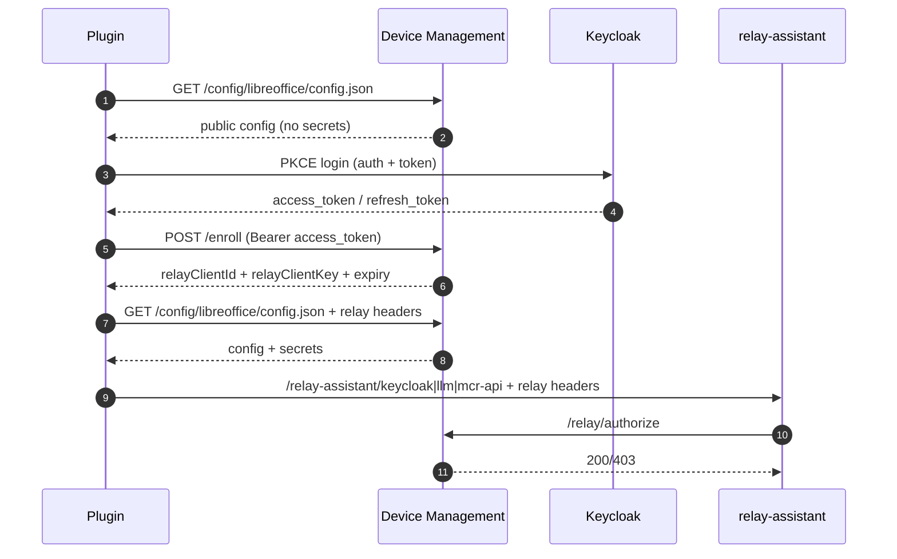

# mirai: A LibreOffice Writer extension for generative AI

## About

This LibreOffice extension integrates a writing assistant directly into Writer: it can **continue a text**, **edit a selection**, **summarize**, and **rephrase** without leaving the document. It connects to an OpenAI‑compatible backend (OpenWebUI, Ollama, etc.) and preserves formatting as much as possible. It also includes a **simplified enrollment mechanism** via Device Management to preconfigure key parameters (base URLs, API tokens, default models, etc.).

This is a LibreOffice Writer extension that enables inline generative editing with AI language models. It's compatible with OpenAI API, OpenWebUI, Ollama, and other OpenAI-compatible endpoints.

**Origin and Attribution:**

This application is a beta version developed as part of the French Ministry of Interior's mirai program. It is based on the work of **John Balis**, author of the **mirai extension**, which served as the technical foundation for this adaptation.

For complete information about sources and attributions, please refer to `registration/license.txt`.

Key repositories:
- Original mirai project by John Balis: [https://github.com/balisujohn/mirai](https://github.com/balisujohn/mirai)
- LibreOffice code portions (MPL 2.0): [https://gerrit.libreoffice.org/c/core/+/159938](https://gerrit.libreoffice.org/c/core/+/159938)
- mirai experimental version source code: [https://github.com/IA-Generative/AssistantmiraiLibreOffice](https://github.com/IA-Generative/AssistantmiraiLibreOffice)

---

## Résumé en français

Cette extension LibreOffice intègre un assistant d’écriture : génération de suite, modification, résumé et reformulation directement dans Writer. Elle se connecte à un backend compatible OpenAI/OpenWebUI et inclut un enrôlement simplifié via Device Management. Les prochaines étapes sont l’enrôlement silencieux, la récupération automatique du token OpenWebUI, l’externalisation de tous les prompts et la mise à jour automatique de l’extension.


## Table of Contents

*   [About](#about)
*   [Table of Contents](#table-of-contents)
*   [Features](#features)
    *   [Continue the selection](#-continue-the-selection)
    *   [Edit the selection](#-edit-the-selection)
    *   [Summarize the selection](#-summarize-the-selection)
    *   [Rephrase the selection](#-rephrase-the-selection)
*   [Setup](#setup)
    *   [LibreOffice Extension Installation](#libreoffice-extension-installation)
    *   [Backend Setup](#backend-setup)
        *   [text-generation-webui](#text-generation-webui)
        *   [Ollama](#ollama)
        *   [OpenWebUI](#openwebui)
*   [Settings](#settings)
*   [Contributing](#contributing)
    *   [Local Development Setup](#local-development-setup)
    *   [Building the Extension Package](#building-the-extension-package)
*   [License](#license)
*   [Update History (Summary)](#update-history-summary)
*   [Device Management (Status & TODO)](#device-management-status--todo)
*   [Secure Bootstrap / Relay Flow](#secure-bootstrap--relay-flow)
*   [Résumé en français](#résumé-en-français)


## Repository Structure (for contributors)

The repository is organized to separate extension resources, Python code, and local configuration:

- `src/mirai/entrypoint.py`: main extension implementation (`MainJob`, UNO registration)
- `src/mirai/menu_actions/`: menu action handlers split by context (`writer.py`, `calc.py`, `shared.py`)
- `main.py`: thin compatibility shim required by LibreOffice Python loader
- `oxt/`: static files packaged at the root of the `.oxt` (Addons, icons, manifest, assets)
- `config/config.default.example.json`: committable example defaults
- `config/profiles/`: predefined profile configs (`docker`, `kubernetes`, `dgx`, `local-llm`)
- `config/config.default.json`: local real defaults (ignored by git)
- `scripts/02-build-oxt.sh`: build script producing `dist/mirai.oxt`
- `scripts/04-repack-oxt.sh`: utility to inject `config.default.json` in an existing `.oxt`
- `scripts/01-init-default-config.sh`: initialize/update default Keycloak/proxy/bootstrap keys in `config/config.default.json`
- `scripts/05-update-plugin.sh`: one-command build + install + restart
- `scripts/06-use-config-profile.sh`: switch local config to a target profile
- `scripts/07-package-release.sh`: package OXT with a specific profile (production-friendly)
### Script quickstart

```bash
# 1) Initialize default config keys (interactive)
./scripts/01-init-default-config.sh --interactive

# 2) Build OXT from source tree
./scripts/02-build-oxt.sh

# 3) Run local checks
./scripts/03-test-local.sh

# 4) Repack an existing OXT with current config defaults
./scripts/04-repack-oxt.sh --src ./dist/mirai.oxt --out ./dist/mirai.oxt

# 5) Build + install + restart LibreOffice
./scripts/05-update-plugin.sh

# 6) Switch local config profile quickly
./scripts/06-use-config-profile.sh --list
./scripts/06-use-config-profile.sh --profile docker --print

# 7) Build a profile-specific release package
./scripts/07-package-release.sh --profile dgx --output ./dist/mirai.oxt
```

### Config profiles and release workflow

Predefined profiles:
- `docker`: local bootstrap (`http://localhost:3001`, `profile=dev`)
- `kubernetes`: generic k8s endpoint template (`https://bootstrap.fake-domain.name`, `profile=prod`)
- `dgx`: DGX route (`https://onyxia.gpu.minint.fr/bootstrap`, `profile=prod`)
- `local-llm`: 100% local fallback (bootstrap disabled, fixed local endpoint/model)

Simple developer mode switch:
```bash
./scripts/06-use-config-profile.sh --profile docker
./scripts/02-build-oxt.sh --install --restart
```

Production packaging (recommended):
```bash
# 1) Build with DGX profile without mutating local config
./scripts/07-package-release.sh --profile dgx --output ./dist/mirai.oxt

# 2) Optional: install locally to smoke-test
./scripts/07-package-release.sh --profile dgx --output ./dist/mirai.oxt --install --restart
```

100% local fallback (no bootstrap):
```bash
./scripts/06-use-config-profile.sh --profile local-llm --print
./scripts/02-build-oxt.sh --install --restart
```

Notes:
- `dist/mirai.oxt` is ignored by git.
- Keep secrets out of profile files; secrets should come from bootstrap after login/enroll.


## Features

This extension provides four powerful features for LibreOffice Writer, allowing you to integrate generative AI directly into your writing workflow:

### ✨ Continue the selection

**Keyboard shortcut:** `CTRL + Q`

This feature uses a language model to predict and generate what follows the selected text. Common use cases include:

*   **Creative writing**: Continue a story, narrative, or develop an idea
*   **Writing assistance**: Complete an email, letter, or professional document
*   **List generation**: Add items to a list of tasks, ideas, or actions
*   **Brainstorming**: Explore different ways to continue a text

**Result:** The generated text is appended immediately after your selection, preserving formatting.

---

### ✏️ Edit the selection

**Keyboard shortcut:** `CTRL + E`

This command opens a dialog where you can specify how to modify the selected text. The AI then transforms your text according to your instructions.

**Common use cases:**

*   **Tone adjustment**: Make an email more formal or more casual
*   **Translation**: Translate text into another language
*   **Style correction**: Improve grammar, spelling, or style
*   **Adaptation**: Change the level of language (technical, simplified, academic)
*   **Creative revision**: Rewrite a scene in a different style or point of view

**How to use:**
1. Select the text to modify
2. Press `CTRL + E`
3. Enter your instructions (e.g., "Translate to English", "Make it more professional", "Fix typos")
4. The modified text is added after your selection with clear delimiters

**Result:** The original text is preserved, and the modification is appended below with visible delimiters:
```
---modification-de-la-sélection---
[Your edited text appears here]
---fin-de-la-modification---
```

---

### 📝 Summarize the selection

**Keyboard shortcut:** `CTRL + R`

This feature generates a concise summary of the selected text. Ideal for extracting key points from long documents, preparing a synthesis, or getting a quick overview.

**Use cases:**

*   **Document synthesis**: Summarize a report, article, or meeting note
*   **Information extraction**: Get essential points from long text
*   **Presentation prep**: Create slide bullet points from detailed content
*   **Quick review**: Check the main content of a text quickly

**How to use:**
1. Select the text to summarize
2. Press `CTRL + R`
3. The summary is automatically generated and added after your selection

**Result:** The summary is inserted with distinct delimiters:
```
---début-du-résumé---
[The concise summary appears here]
---fin-du-résumé---
```

---

### 💬 Rephrase the selection

**Keyboard shortcut:** `CTRL + L`

This feature rewrites the selected text in a clearer, more accessible form while preserving the original meaning. Perfect for improving readability and comprehension.

**Use cases:**

*   **Simplification**: Make technical text accessible to a general audience
*   **Clarification**: Improve comprehension of complex text
*   **Popularization**: Adapt specialized content for non‑experts
*   **Communication improvement**: Make writing more direct and clear

**How to use:**
1. Select the text to rephrase
2. Press `CTRL + L`
3. The rephrased text is generated in the same language as your text

**Result:** The rephrasing is added with delimiters:
```
---début-de-la-reformulation---
[Your clearer rephrased text appears here]
---fin-de-la-reformulation---
```

---

### 🌐 Access the mirai website

Access the official mirai website (https://mirai.interieur.gouv.fr) from the extension menu for more information about the program and available tools.

---

### ⚙️ Settings

Configure the extension to your needs: LLM base URL(s), default model(s), API token(s), and advanced options.

**Proxy support**

The extension can route all HTTP requests through a proxy (including Device Management, model discovery, and API calls). Proxy settings are available in the Preferences dialog via the **Proxy...** button.

Config keys (in `config.json` / `config.default.json`):

```json
{
  "proxy_enabled": false,
  "proxy_url": "proxy.example.local:8080",
  "proxy_allow_insecure_ssl": true,
  "proxy_username": "",
  "proxy_password": ""
}
```

Notes:
* If `proxy_username` or `proxy_password` is empty, proxy authentication is **not** enabled.
* `proxy_allow_insecure_ssl` mirrors the `-k` behavior (HTTPS without certificate validation).
* On startup, the extension checks LibreOffice proxy settings and warns if they differ from MIrAI preferences.
* The Proxy dialog lets you test the connection and copy LibreOffice proxy values.

---

## Feature behavior

### Preservation of original text

**Important:** The “Edit”, “Summarize”, and “Rephrase” features **never delete** your original text. They append the generated result right after your selection with clear delimiters. This lets you:

- Compare the original and generated versions
- Choose the version that suits you
- Keep a trace of changes
- Manually remove what you don’t want

Only “Continue the selection” inserts text without delimiters because it is designed to flow naturally.

### Formatting preservation

The extension **preserves formatting as much as possible** (bold, italics, colors, etc.). However, depending on the model used (OpenAI, Mistral, Ollama, OpenWebUI, etc.), formatting may vary slightly.

### ⚠️ Known limitations

- **Formatting**: Some models may change line breaks or punctuation
- **Model behavior**: The AI may sometimes ask questions instead of following instructions; the extension detects this and asks you to reformulate your request
- **Language**: Models generally perform best in English and French

---

## Telemetry and monitoring

### OpenTelemetry

The extension now integrates **OpenTelemetry** for usage tracking and monitoring. This feature collects anonymized traces about feature usage.

**⚡ Asynchronous telemetry (non‑blocking):**

Telemetry calls are **fully asynchronous** and run in separate daemon threads. This ensures:

- ✅ The plugin **never blocks** while waiting for telemetry
- ✅ Features remain **responsive** even if the backend is down
- ✅ The user experiences **no slowdown** (5s timeout in a separate thread)
- ✅ Telemetry errors do not affect normal operation
- ✅ Threads terminate automatically when LibreOffice closes

**Telemetry configuration:**

In your `mirai.json` (or config file), you can configure:

```json
{
  "telemetryEnabled": true,
  "telemetryEndpoint": "https://traces.cpin.numerique-interieur.com/v1/traces",
  "telemetryAuthorizationType": "Basic",
  "telemetryKey": "your-base64-encoded-key",
  "telemetrylogJson": false
}
```

**Available parameters:**

| Parameter | Description | Default |
|-----------|-------------|---------|
| `telemetryEnabled` | Enable/disable telemetry | `true` |
| `telemetryEndpoint` | OpenTelemetry/Tempo endpoint URL | `https://traces.cpin.numerique-interieur.com/v1/traces` |
| `telemetryAuthorizationType` | Authentication type | `Basic` or `Bearer` |
| `telemetryKey` | Base64 auth key | `""` (uses obfuscated key) |
| `telemetrylogJson` | Detailed logs with full HTTP headers | `false` (enable for debug) |
| `telemetrySel` | Telemetry salt | `mirai_salt` |
| `telemetryHost` | Custom host | `""` (optional) |
| `telemetryFormatProtobuf` | Protobuf format | `false` (not implemented) |

---

## Update History (Summary)

This project has gone through many iterations. Here is a summary of the most recent changes:

- **Configuration**: `config.default.json` is now packaged with the extension, with auto‑init of the user `config.json` if missing or empty, and merge/upgrade based on `configVersion`.
- **Device Management**: bootstrap `/config/...` integration with local sync; empty values no longer overwrite local config.
- **OpenWebUI**: full support for LLM settings (base URLs, API tokens, headers). Added diagnostics (logs/curl) for model and chat calls.
- **Keycloak/SSO**: Authorization Code + PKCE flow with local redirect; multi‑URI handling; improved re‑login UX.
- **Preferences UI**: simplified dialog, model dropdown, dynamic description, API status indicator, reload button, splash image, masked token with reveal toggle.
- **Proxy support**: configurable proxy (URL, optional auth), TLS `-k` toggle, startup consistency check with LibreOffice settings, and a Proxy dialog with connection test.
- **Editing**: new “Edit selection” dialog always on top, resizable, with send button and system close handling.
- **Logs & diagnostics**: better network logs, HTTP error handling, user notification when token expired.

## Device Management (Status & TODO)

Device Management integration is in place, but several items remain:

Déploiement progressif (synthèse): le plugin appelle Device Management avec son `plugin_uuid`, sa version et, après login PKCE, un token Keycloak; DM valide le token (signature/JWKS, `iss`, `aud`, `exp`), extrait l’identité utilisateur (`sub`) et les `groups`, applique la priorité des groupes de déploiement (d’abord les 5 groupes câblés dans l’outil de management, puis les groupes Keycloak mappés), puis renvoie une policy de campagne (`none/update/rollback`, version cible, artefact, hash/signature, pourcentage de rollout). Le plugin n’installe que si la policy l’autorise et si la vérification cryptographique est valide, puis remonte les indicateurs (`success/failure`) pour piloter des campagnes démarrables/arrêtables (canary, promotion, rollback) avec suivi par groupe.

**TODO:**
- Finalize **silent enrollment**.
- Implement **automatic OpenWebUI token retrieval**.
- **Externalize all prompts** via Device Management (all prompts must become configurable).
- Implement the **automatic update mechanism** for the extension.

## Secure Bootstrap / Relay Flow



### Local validation

```bash
./scripts/03-test-local.sh
```
