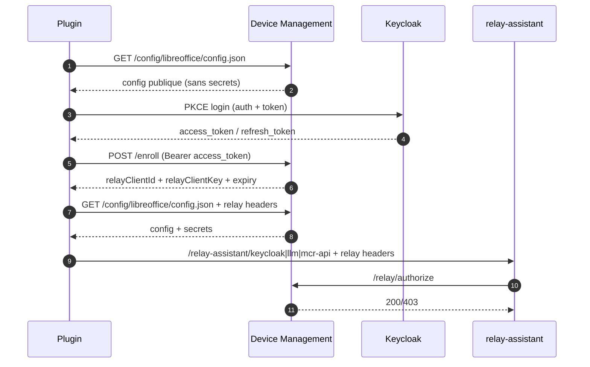

# MIrAI — Assistant LibreOffice

Extension LibreOffice intégrant un assistant IA directement dans Writer et Calc. Elle se connecte à un backend compatible OpenAI (OpenWebUI, Ollama, Scaleway, etc.) et inclut un mécanisme d'enrôlement via Device Management pour préconfigurer les URLs, tokens et modèles.

**Origine :** cette application est une version bêta développée dans le cadre du programme MIrAI du ministère de l'Intérieur. Elle s'appuie sur le travail de **John Balis**, auteur de l'extension [mirai](https://github.com/balisujohn/mirai), et sur des portions de code LibreOffice (MPL 2.0 — [gerrit.libreoffice.org](https://gerrit.libreoffice.org/c/core/+/159938)). Voir `registration/license.txt` pour les attributions complètes.

---

## Table des matières

- [Fonctionnalités Writer](#fonctionnalités-writer)
- [Fonctionnalités Calc](#fonctionnalités-calc)
- [Comportement général](#comportement-général)
- [Installation](#installation)
- [Configuration](#configuration)
- [Structure du dépôt](#structure-du-dépôt)
- [Scripts de développement](#scripts-de-développement)
- [Télémétrie et monitoring](#télémétrie-et-monitoring)
- [Device Management et bootstrap](#device-management-et-bootstrap)
- [Historique des mises à jour](#historique-des-mises-à-jour)
- [License](#license)

---

## Fonctionnalités Writer

### ✨ Continuer la sélection — `Ctrl+Q`

Génère la suite naturelle du texte sélectionné. Le texte produit est inséré directement après la sélection, sans délimiteurs. Cas d'usage : écriture créative, complétion d'emails, listes d'idées.

### ✏️ Modifier la sélection — `Ctrl+E`

Ouvre une boîte de dialogue permettant de saisir des instructions (traduction, reformulation formelle, correction stylistique…). Le résultat est inséré après la sélection avec des délimiteurs visibles :

```
---modification-de-la-sélection---
[texte modifié]
---fin-de-la-modification---
```

### 📝 Résumer la sélection — `Ctrl+R`

Génère un résumé concis du texte sélectionné. Utile pour synthétiser des rapports, extraire les points clés ou préparer un support de présentation. Résultat inséré avec délimiteurs :

```
---début-du-résumé---
[résumé]
---fin-du-résumé---
```

### 💬 Simplifier la sélection — `Ctrl+L`

Reformule le texte sélectionné en langage clair et accessible, en conservant le sens. Idéal pour vulgariser un contenu technique ou réglementaire. Résultat inséré avec délimiteurs :

```
---début-de-la-reformulation---
[texte simplifié]
---fin-de-la-reformulation---
```

### 📄 Modifier tout le document — menu MIrAI

Applique une instruction à l'ensemble du document par chunks successifs via un protocole `<<<FIND>>>…<<<REPLACE>>>…<<<END>>>`. Utile pour une traduction complète, une harmonisation de style, etc.

### 📚 Documentation — menu MIrAI

Ouvre l'URL de documentation configurée via le bootstrap (`doc_url`) avec repli sur `portal_url`. Sans-op silencieux si aucune URL n'est définie.

---

## Fonctionnalités Calc

### 🧮 Générer une formule — `Ctrl+Shift+F`

Génère une formule LibreOffice Calc à partir d'une description en langage naturel. L'extension injecte automatiquement le contexte de la feuille (en-têtes de colonnes, plage de données, valeurs de la ligne courante) dans le prompt pour que le modèle produise une formule précise et directement applicable.

**Fonctionnement :**
1. Sélectionner la cellule cible
2. Appuyer sur `Ctrl+Shift+F`
3. Décrire la formule souhaitée (ex. : « somme des ventes si région = Nord »)
4. La formule générée est insérée dans la cellule

**Boucle de correction automatique :** si la formule insérée retourne une erreur (`#VALEUR!`, `#REF!`…), l'extension détecte l'erreur, la renvoie au modèle et redemande une correction (jusqu'à 3 tentatives).

**Nettoyage markdown :** les artefacts de formatage LLM (`**`, `_`, `` ` ``, `#`) sont supprimés avant insertion.

---

## Comportement général

### Préservation du texte original

Les fonctions **Modifier**, **Résumer** et **Simplifier** n'effacent jamais le texte original : le résultat est ajouté après la sélection avec des délimiteurs. Seul **Continuer** insère directement (c'est son rôle).

### Gestion des modèles

- **Modèles deepseek-r1** : les balises `<think>…</think>` (chaîne de raisonnement) sont automatiquement filtrées avant insertion dans le document.
- **Détection de question** : si le modèle répond par une question au lieu d'exécuter la tâche, l'extension le détecte et propose de reformuler l'instruction.
- **Retry automatique** : sur `extend_selection`, si le modèle pose une question, un second appel est effectué avec un prompt plus directif.

### Limitations connues

- Certains modèles modifient les sauts de ligne ou la ponctuation
- Les modèles très verbeux (`holo2-30b-a3b`) peuvent épuiser le budget de tokens en préambule — voir `bench/scaleway_model_comparison.md`
- Performances optimales en français et en anglais

---

## Installation

### Prérequis

- LibreOffice 7.x ou supérieur
- Python 3.9+ (inclus avec LibreOffice)
- Accès à un backend compatible OpenAI

### Installation de l'extension

```bash
# 1. Construire le paquet OXT
./scripts/02-build-oxt.sh

# 2. Installer + relancer LibreOffice
./scripts/05-update-plugin.sh
```

Ou via l'interface : **Outils → Gestionnaire d'extensions → Ajouter** → sélectionner `dist/mirai.oxt`.

### Installation rapide (développement)

```bash
./scripts/dev-launch.sh   # build + install + restart LibreOffice
```

---

## Configuration

### Via l'interface

**Menu MIrAI → Paramètres** : URL du backend, modèle par défaut, token API, proxy.

### Fichiers de configuration

| Fichier | Rôle |
| --- | --- |
| `config/config.default.json` | Valeurs par défaut packagées dans l'OXT |
| `config/config.default.example.json` | Exemple committable (sans secrets) |
| `config/profiles/` | Profils prédéfinis (`docker`, `kubernetes`, `dgx`, `local-llm`) |

Au premier lancement, `config.json` est initialisé depuis `config.default.json` puis mis à jour par le bootstrap Device Management.

### Proxy

```json
{
  "proxy_enabled": false,
  "proxy_url": "proxy.example.local:8080",
  "proxy_allow_insecure_ssl": true,
  "proxy_username": "",
  "proxy_password": ""
}
```

Si `proxy_username` / `proxy_password` sont vides, l'authentification proxy est désactivée. Au démarrage, l'extension vérifie la cohérence avec les paramètres proxy de LibreOffice.

### Profils de déploiement

| Profil | Usage |
| --- | --- |
| `docker` | Bootstrap local (`http://localhost:3001`, `profile=dev`) |
| `kubernetes` | Template k8s générique |
| `dgx` | Route DGX (`https://onyxia.gpu.minint.fr/bootstrap`) |
| `local-llm` | 100 % local, bootstrap désactivé |

```bash
./scripts/06-use-config-profile.sh --profile docker
./scripts/02-build-oxt.sh --install --restart
```

Packaging production (sans muter la config locale) :
```bash
./scripts/07-package-release.sh --profile dgx --output ./dist/mirai.oxt
```

---

## Structure du dépôt

```
src/mirai/
├── entrypoint.py              # MainJob, enregistrement UNO, chunking whole-doc
├── calc_prompt_function.py    # Fonction Calc add-in (XPromptFunction)
└── menu_actions/
    ├── writer.py              # Extend, Edit, Summarize, Simplify, WholeDoc
    ├── calc.py                # GenerateFormula, contexte schéma, retry erreur
    └── shared.py              # Utilitaires partagés

oxt/                           # Fichiers statiques packagés dans l'OXT
├── Addons.xcu                 # Menus et raccourcis
├── CalcAddIn.xcu              # Déclaration fonction Calc
├── Jobs.xcu
└── META-INF/manifest.xml

config/
├── config.default.example.json
└── profiles/                  # docker | kubernetes | dgx | local-llm

scripts/
├── 00-clean-install.sh        # Purge config, logs, cache extension
├── 01-init-default-config.sh  # Init clés Keycloak/proxy/bootstrap
├── 02-build-oxt.sh            # Produit dist/mirai.oxt
├── 03-test-local.sh           # Tests unitaires
├── 04-repack-oxt.sh           # Injecte config dans un OXT existant
├── 05-update-plugin.sh        # Build + install + restart
├── 06-use-config-profile.sh   # Switche le profil local
└── 07-package-release.sh      # Package release avec profil cible

tests/
├── unit/                      # Tests unitaires (pytest, sans LibreOffice)
├── fixtures/                  # Fichiers ODS de test
└── sim_scaleway_models.py     # Benchmark headless des modèles Scaleway

bench/                         # Rapports de benchmark
├── scaleway_model_comparison.md
└── gpt_oss_production_tokens.md
```

---

## Scripts de développement

```bash
# Reset complet (avant un test d'enrôlement)
./scripts/00-clean-install.sh             # garde l'extension installée
./scripts/00-clean-install.sh --uninstall # retire aussi l'extension

# Workflow réenrôlement
./scripts/00-clean-install.sh --uninstall
./scripts/dev-launch.sh

# Tests unitaires
./scripts/03-test-local.sh
# ou directement :
python -m pytest tests/unit/ -v

# Benchmark modèles Scaleway (sans LibreOffice)
python tests/sim_scaleway_models.py
python tests/sim_scaleway_models.py --no-wikipedia   # textes de repli
python tests/sim_scaleway_models.py --max-tokens 2000 --models gpt-oss-120b
```

---

## Télémétrie et monitoring

### OpenTelemetry

Les appels de télémétrie sont **entièrement asynchrones** (threads daemon) : l'extension ne bloque jamais en attente de la télémétrie, même si le backend est indisponible.

```json
{
  "telemetryEnabled": true,
  "telemetryEndpoint": "https://traces.cpin.numerique-interieur.com/v1/traces",
  "telemetryAuthorizationType": "Basic",
  "telemetryKey": "votre-clé-base64",
  "telemetrylogJson": false
}
```

| Paramètre | Description | Défaut |
| --- | --- | --- |
| `telemetryEnabled` | Activer/désactiver | `true` |
| `telemetryEndpoint` | URL OpenTelemetry/Tempo | *(voir ci-dessus)* |
| `telemetryAuthorizationType` | `Basic` ou `Bearer` | `Basic` |
| `telemetryKey` | Clé base64 | `""` |
| `telemetrylogJson` | Logs détaillés (debug) | `false` |

### Grafana (Device Management)

Utiliser l'endpoint `/metrics` de Device Management comme source Prometheus. Dashboards recommandés : `API/Ingress`, `Queue/Workers`, `Capacity/HPA`.

Métriques clés :
- `dm_queue_pending_jobs`, `dm_queue_dead_jobs`, `dm_queue_oldest_pending_age_seconds`
- `nginx_ingress_controller_requests`, `kube_horizontalpodautoscaler_status_current_replicas`

Alertes minimales : `QueueBacklogHigh` (> 1000 pendant 10 min), `QueueDeadLetters` (> 0 pendant 5 min), `Enroll5xxRateHigh` (ratio > 1 % pendant 10 min).

---

## Device Management et bootstrap

### Flux de bootstrap sécurisé



### Assistant d'enrôlement

Wizard en 5 étapes qui reste ouvert pendant le login Keycloak. Affiche un écran de résultat : succès → « Commencer à utiliser » / échec → « Fermer » + raison. Protégé par un verrou threading pour éviter les instances multiples.

### TODO Device Management

- Enrôlement silencieux (sans interaction utilisateur)
- Récupération automatique du token OpenWebUI
- Externalisation de tous les prompts via Device Management
- Mécanisme de mise à jour automatique de l'extension

---

## Historique des mises à jour

| Version / Date | Changements principaux |
| --- | --- |
| 2026-03 | **GenerateFormula Calc** : contexte schéma, boucle retry erreur, nettoyage markdown |
| 2026-03 | **Benchmark Scaleway** : 10/13 modèles ✅ sur textes Wikipedia ; rapport dans `bench/` |
| 2026-03 | **writer.py** : suppression appel `stream_request` en double, suppression faux positifs « voici/voilà » dans simplify, ajout `_strip_think_blocks()` pour deepseek-r1 |
| 2026-03 | **Wizard d'enrôlement** : UX 5 étapes, écran résultat, verrou threading |
| 2026-03 | **Menu Documentation** : `doc_url` depuis bootstrap, repli `portal_url` |
| 2026-03 | **Script 00-clean-install.sh** : purge config, logs et cache extension |
| 2025 | Profils de config, packaging release, `_persist_bootstrap_config` |
| 2025 | Support proxy complet (URL, auth, TLS `-k`, cohérence avec LO) |
| 2025 | Intégration OpenTelemetry asynchrone |
| 2025 | Modification tout le document par chunks (FIND/REPLACE) |

---

## License

- Code original *mirai* : licence de John Balis (voir `registration/license.txt`)
- Portions LibreOffice : MPL 2.0
- Adaptations ministère de l'Intérieur : voir `registration/license.txt`

Dépôts de référence :
- [balisujohn/mirai](https://github.com/balisujohn/mirai) — projet original
- [IA-Generative/AssistantmiraiLibreOffice](https://github.com/IA-Generative/AssistantmiraiLibreOffice) — ce dépôt
- [gerrit.libreoffice.org/c/core/+/159938](https://gerrit.libreoffice.org/c/core/+/159938) — portions MPL 2.0
