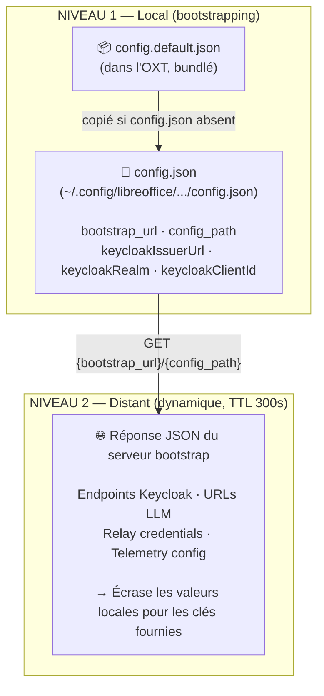
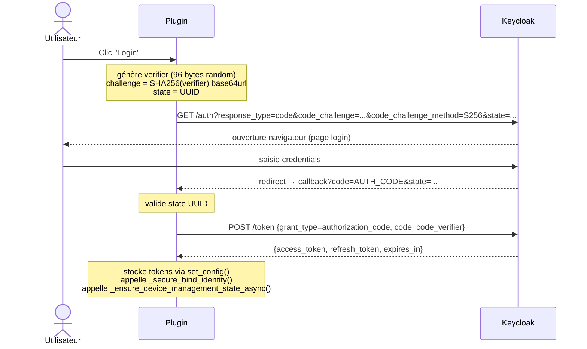
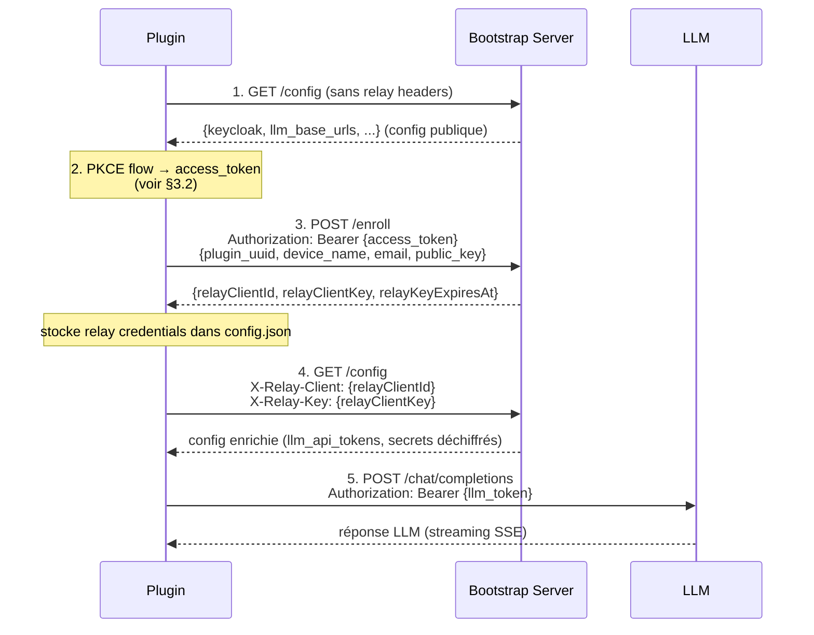
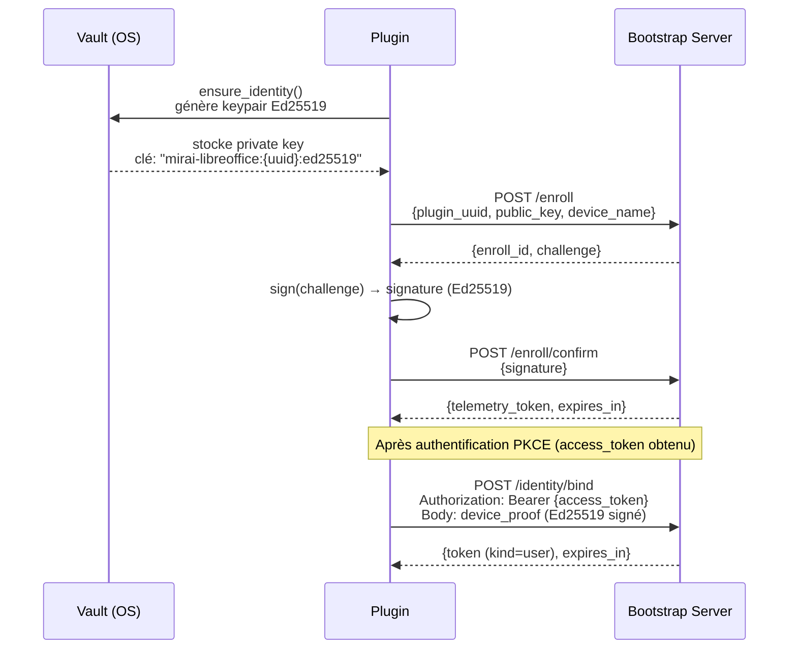
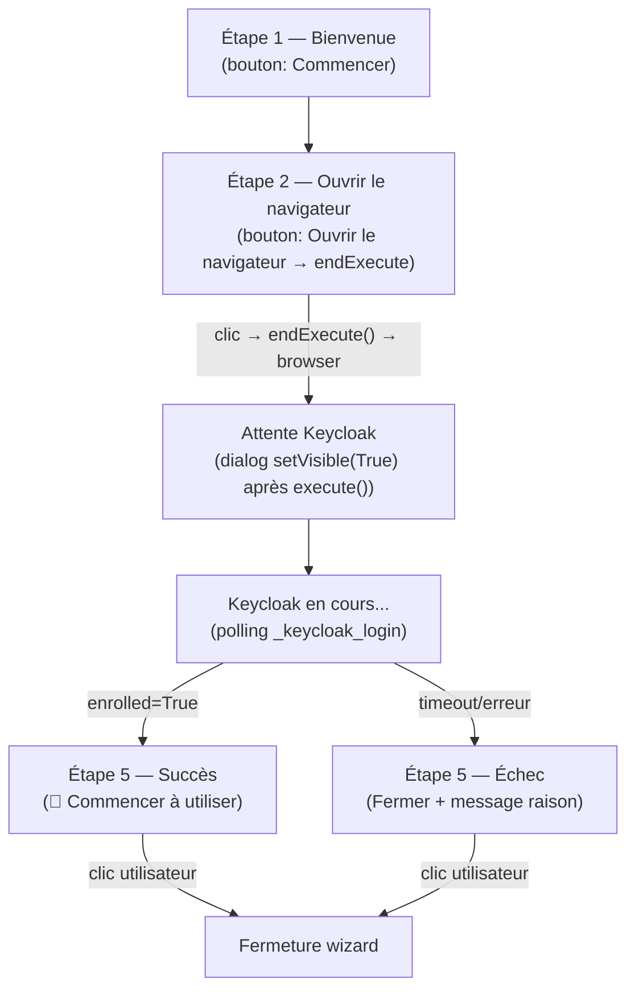

# Prompt de Création — Assistant Mirai LibreOffice

> Document de référence pour recréer l'application from scratch.
> Capture le reverse engineering complet, les NFR, la stratégie de test et l'intégration device-management.
> Produit par analyse statique et exécution du code — mars 2026.

---

## 1. Vision & Contexte

### Qu'est-ce que c'est ?

Un **plug-in LibreOffice** (format `.oxt`) qui intègre un LLM (Large Language Model) directement dans Writer et Calc. L'utilisateur peut sélectionner du texte et déclencher des actions IA (générer, modifier, ajuster la longueur, résumer, reformuler) via un menu dédié.

Le plug-in est conçu pour une organisation (Ministère de l'Intérieur, France) qui :
- Gère une infrastructure propre (SSO Keycloak, serveur LLM derrière relay)
- Exige une authentification forte (PKCE + device management + Ed25519)
- Collecte de la télémétrie anonyme pour mesurer l'usage
- Doit fonctionner derrière proxy d'entreprise

### Stack technique

- **Langage** : Python 3.x (embarqué dans LibreOffice)
- **API UNO** : `unohelper.Base`, `com.sun.star.*` (Java-like, mais Python)
- **Cryptographie** : `cryptography` (Ed25519), `hashlib` (PKCE SHA256)
- **HTTP** : `urllib.request` uniquement (pas de `requests`)
- **Télémétrie** : OpenTelemetry OTLP/JSON
- **Auth** : OAuth2 Authorization Code + PKCE (RFC 7636), Keycloak
- **Build** : ZIP → `.oxt` (script bash)

### Namespace UNO
```
fr.gouv.interieur.mirai
```

---

## 2. Architecture des fichiers

```
AssistantMiraiLibreOffice/
├── main.py                          # Shim UNO — importe depuis src/mirai/entrypoint
├── oxt/                             # Package de l'extension
│   ├── META-INF/manifest.xml        # Déclaration des composants UNO
│   ├── Addons.xcu                   # Menu LibreOffice (Writer + Calc)
│   ├── Accelerators.xcu             # Raccourcis clavier
│   ├── CalcAddIn.xcu                # Déclaration fonction =PROMPT()
│   ├── description.xml              # Métadonnées extension (version, auteur)
│   ├── icons/                       # Icônes 16/48/128px
│   └── registration/license.txt    # Licence MPL 2.0
├── src/mirai/
│   ├── entrypoint.py                # ★ Cœur (5000+ lignes) — MainJob
│   ├── security_flow.py             # ★ Secure bootstrap, vault, telemetry
│   ├── calc_prompt_function.py      # CalcAddIn =PROMPT()
│   ├── menu_actions/
│   │   ├── calc.py                  # Actions menu Calc
│   │   ├── writer.py                # Actions menu Writer
│   │   └── shared.py                # Utilitaires partagés
│   └── CAbundle/
│       └── scaleway-bootstrap-ca-chain.pem  # CA bundlé pour TLS
├── config/
│   ├── config.default.json          # ⛔ gitignored — config active
│   ├── config.default.example.json  # Template (bootstrap_url, config_path)
│   ├── bootstrap.server.minimal.json # Template réponse du serveur bootstrap
│   ├── keycloak-client-export.json  # ⛔ gitignored — ClientRepresentation Keycloak
│   ├── keycloak-client-export.example.json
│   └── profiles/
│       ├── config.default.dev.json          # ✓ localhost:8082, openwebui
│       ├── config.default.docker.json       # ✓ localhost:3001
│       ├── config.default.local-llm.json    # ✓ Ollama local, pas de bootstrap
│       ├── config.default.dgx.json          # ✓ on-premise GPU
│       ├── config.default.kubernetes.json   # ✓ bootstrap.fake-domain.name (Scaleway)
│       ├── config.default.integration.json  # ⛔ gitignored — URLs réelles intégration (profile=int)
│       └── config.default.production.json   # ⛔ gitignored — URLs réelles prod
├── scripts/
│   ├── 00-clean-install.sh          # ★ Purge config + logs + extension cache (--uninstall)
│   ├── 02-build-oxt.sh              # Build → dist/mirai.oxt
│   ├── 05-update-plugin.sh          # Build + install + restart LO
│   ├── 06-use-config-profile.sh     # Switcher de profil config
│   └── dev-launch.sh                # Build + install + open document test
├── tests/
│   ├── stubs/uno_stubs.py           # Stubs UNO pour tests hors LibreOffice
│   ├── unit/
│   │   └── test_documentation_url.py  # ★ Tests fallback doc_url / portal_url
│   └── integration/
│       ├── mock_http.py             # MockHttpRouter (intercepte _urlopen)
│       └── test_full_enrollment_flow.py  # Flow complet PKCE → DM → LLM
└── prompts/
    └── prompt-creation.md           # Ce fichier
```

---

## 3. Domaines métier & algorithmes clés

### 3.1 Chaîne de configuration (deux niveaux)



**Méthodes clés :**
- `_get_config_from_file(key, default)` → lit config.json (utilisateur) + config.default.json (package), merge, auto-initialise
- `_fetch_config(force=False)` → GET HTTP vers bootstrap, TTL 300s, backoff 30s sur erreur
- `get_config(key, default)` → priorité : DM cache → fichier local → telemetry defaults
- `set_config(key, value)` → écrit config.json de façon thread-safe (verrou fichier)

**Format config.json :**
```json
{
  "configVersion": 1,
  "enabled": true,
  "bootstrap_url": "http://localhost:8082",
  "config_path": "/config/libreoffice/config.json?profile=dev",
  "keycloakIssuerUrl": "http://localhost:8082/realms/openwebui",
  "keycloakRealm": "openwebui",
  "keycloakClientId": "bootstrap-iassistant",
  "keycloak_redirect_uri": "http://localhost:28443/callback",
  "keycloak_allowed_redirect_uri": ["http://localhost:28443/callback"],
  "llm_base_urls": "...",
  "llm_api_tokens": "...",
  "llm_default_models": "..."
}
```

---

### 3.2 Flux d'authentification PKCE (RFC 7636)



**Paramètres PKCE :**
- Verifier : 96 bytes → base64url → 128 chars (sans padding)
- Challenge : SHA256(verifier) → base64url → 43 chars (sans padding)
- Méthode : `S256`
- Code challenge method dans Keycloak : obligatoire côté client

**Callback local :**
- Serveur HTTP ThreadingHTTPServer sur `localhost:{port_dynamique}`
- Timeout : 120s configurable
- Réponse HTML au navigateur (page de succès/erreur)
- Extraction `code` + `state` depuis query params
- Validation état via `state` UUID

---

### 3.3 Device Management — Séquence d'enrôlement



**Headers relay :**
```python
{"X-Relay-Client": relay_client_id, "X-Relay-Key": relay_client_key}
```
Ajoutés à TOUS les appels `_fetch_config()` dès qu'ils sont configurés.

**State persisté dans config.json :**
```json
{
  "enrolled": true,
  "relay_client_id": "...",
  "relay_client_key": "...",
  "relay_key_expires_at": 1234567890,
  "plugin_uuid": "...",
  "access_token": "...",
  "refresh_token": "..."
}
```

---

### 3.4 Secure Bootstrap Flow (security_flow.py)

Couche de sécurité au-dessus du bootstrap standard :



**Vault multi-plateforme :**
- macOS : `security` CLI (Keychain)
- Linux : `secret-tool` (libsecret/SecretService)
- Windows : ctypes + CredMan (Advapi32)
- Tests : MemoryVault

**Clé vault :** `"mirai-libreoffice:{plugin_uuid}:ed25519"` → private key base64

**Device proof (signé Ed25519) :**
```json
{
  "plugin_uuid": "...",
  "enroll_id": "...",
  "public_key": "...(base64)...",
  "nonce": "...(random)...",
  "timestamp": 1234567890,
  "signature": "...(base64 Ed25519)..."
}
```

---

### 3.5 Appels LLM — Format OpenAI-compatible

**Endpoint résolu :**
```python
base = llm_base_urls.rstrip("/")
# Chat : {base}/api/chat/completions ou {base}/v1/chat/completions
# Completions : {base}/api/completions ou {base}/v1/completions
```

**Request body :**
```json
{
  "model": "...",
  "messages": [
    {"role": "system", "content": "..."},
    {"role": "user", "content": "..."}
  ],
  "stream": true,
  "max_tokens": 15000
}
```

**Streaming SSE parsing :**
```
data: {"choices": [{"delta": {"content": "..."}, "finish_reason": null}]}
data: {"choices": [{"delta": {}, "finish_reason": "stop"}]}
data: [DONE]
```

**Limites modèles connues :**
- `deepseek-r1` → max_tokens = 8196
- `llama-3.3-70b` → max_tokens = 4096
- Défaut → 15000

**Auth headers :**
```python
{"Authorization": f"Bearer {api_key}", "Content-Type": "application/json"}
```

**Réponse synchrone (=PROMPT() Calc) :**
```python
body["stream"] = False
# Retourne choices[0].message.content (chat) ou choices[0].text (completions)
# Erreurs → "#PROMPT_ERROR: {message}" (jamais d'exception)
```

---

### 3.6 Télémétrie OpenTelemetry

**Format OTLP/JSON :**
```json
{
  "resourceSpans": [{
    "resource": {"attributes": [
      {"key": "service.name", "value": {"stringValue": "mirai-libreoffice"}},
      {"key": "plugin.uuid", "value": {"stringValue": "..."}}
    ]},
    "scopeSpans": [{
      "spans": [{
        "traceId": "...(hex 32)...",
        "spanId": "...(hex 16)...",
        "name": "ExtendSelection",
        "startTimeUnixNano": "...",
        "endTimeUnixNano": "...",
        "attributes": [
          {"key": "model", "value": {"stringValue": "..."}}
        ]
      }]
    }]
  }]
}
```

**Events instrumentés :** ExtensionLoaded, ExtendSelection, EditSelection, ResizeSelection, SummarizeSelection, SimplifySelection, OpenmiraiWebsite, OpenSettings, OpenDocumentation

**Garanties de privacy :** Aucun texte utilisateur, aucun prompt, aucune PII dans les spans.

**Queue offline :** FileQueueStore (`telemetry_queue.json`), TTL 86400s, retry exponentiel (2^n secondes ±10% jitter).

---

### 3.7 Threading & Locks

```mermaid
flowchart TD
    MJ[MainJob]

    MJ --> CWL["_config_write_lock\n(threading.Lock)\nset_config() atomique"]
    MJ --> CRL["_config_refresh_lock\n(threading.RLock)\n_schedule_config_refresh()"]
    MJ --> APL["_auth_prompt_lock\n(threading.Lock)\névite dialogs auth simultanés"]
    MJ --> SFL["_secure_flow_lock\n(threading.RLock)\nlazy-init SecureBootstrapFlow"]
    MJ --> EWL["_enrollment_wizard_lock\n(threading.Lock)\névite wizards simultanés (timer + menu)"]

    MJ --> T1["Thread daemon: _schedule_config_refresh()\n→ _fetch_config()  [throttle 20s]"]
    MJ --> T2["Thread daemon: _warmup_secure_flow_async()\n→ ensure_identity()"]
    MJ --> T3["Thread daemon: _ensure_device_management_state_async()"]
    MJ --> T4["Thread daemon: edit selection refresh loop\n[toutes les 3s]"]
    MJ --> T5["Thread daemon: _deferred_enrollment()\n→ _show_enrollment_wizard()  [délai 3s après init]"]

    style CWL fill:#ddf,stroke:#99b
    style CRL fill:#ddf,stroke:#99b
    style APL fill:#ddf,stroke:#99b
    style SFL fill:#ddf,stroke:#99b
    style EWL fill:#ddf,stroke:#99b
    style T1 fill:#ffd,stroke:#bb9
    style T2 fill:#ffd,stroke:#bb9
    style T3 fill:#ffd,stroke:#bb9
    style T4 fill:#ffd,stroke:#bb9
    style T5 fill:#ffd,stroke:#bb9
```



**Guards importants :**
- `_fetching_config` (bool) → récursion guard dans `_fetch_config()`
- `_auth_prompt_in_progress` + cooldown 30s → empêche multi-dialogs auth
- `_auth_prompted_at` → timestamp dernière demande auth
- `_enrollment_wizard_active` (bool) + `_enrollment_wizard_lock` → empêche deux wizards simultanés (timer 3s + clic menu)

**Bypass d'enrôlement dans `trigger()` :**
```python
_enrollment_bypass = {"Documentation", "OpenmiraiWebsite", "settings", "proxy_settings"}
# Ces actions n'interceptent pas l'enrôlement — elles sont toujours autorisées
```

---

### 3.8 SSL / TLS

```python
ctx = ssl.create_default_context()
# Option proxy insecure (uniquement si proxy_allow_insecure_ssl=True)
if allow_insecure: ctx.check_hostname = False; ctx.verify_mode = ssl.CERT_NONE
# CA bundle bundlé
ctx.load_verify_locations(cafile="src/mirai/CAbundle/scaleway-bootstrap-ca-chain.pem")
```

**Règle absolue : ne jamais utiliser `ssl.CERT_NONE` en production.**
Le CA bundle Scaleway est nécessaire car LibreOffice Python n'utilise pas le keystore système.

---

### 3.9 Wizard d'enrôlement — UX 5 étapes

Le wizard guide l'utilisateur à travers l'enrôlement complet et **reste ouvert** jusqu'à l'action explicite de l'utilisateur.



**Point technique critique — `execute()` vs `setVisible()` :**
- `execute()` démarre une boucle modale UNO et bloque jusqu'à ce que `endExecute()` soit appelé
- Quand `endExecute()` est appelé (clic "Ouvrir le navigateur"), LibreOffice **cache automatiquement** le dialog
- Pour garder le dialog visible pendant les étapes automatiques suivantes, appeler **obligatoirement** `dialog.setVisible(True)` immédiatement après que `execute()` retourne
- `processEventsToIdle()` doit être appelé dans les boucles de polling pour mettre à jour l'UI depuis le thread principal UNO

```python
# Pattern correct : re-show après execute()
ok, dialog, toolkit, _update_custom, result = _show_enrollment_wizard(...)
try:
    dialog.setVisible(True)   # ← OBLIGATOIRE sinon dialog disparaît
except Exception:
    pass
# ... polling Keycloak ...
_update_custom(step=4, text="Connexion en cours...", btn_next=None, btn_cancel=None)
toolkit.processEventsToIdle()
```

**Boutons sans chevauchement (`_update_custom`) :**
```python
if btn_cancel:
    dialog.getControl("wiz_btn_cancel").setPosSize(btn_cancel_x, btn_y, BTN_W, BTN_H, POSSIZE)
    dialog.getControl("wiz_btn_next").setPosSize(btn_next_x, btn_y, BTN_W, BTN_H, POSSIZE)
else:
    # Pousser cancel hors écran (pas de setVisible ni setEnable — bouton reste actif)
    dialog.getControl("wiz_btn_cancel").setPosSize(-BTN_W - 10, btn_y, BTN_W, BTN_H, POSSIZE)
    dialog.getControl("wiz_btn_next").setPosSize((WIDTH - BTN_W) // 2, btn_y, BTN_W, BTN_H, POSSIZE)
```

**Constantes :** `BTN_W = 175` (suffisant pour "🚀 Commencer à utiliser"), `BTN_H = 26`, `WIDTH = 420`

---

### 3.10 Ajuster la longueur — `ResizeSelection` (⌘J)

Mini-dialogue flottant avec boutons **−** / **+** pour réduire ou développer le texte sélectionné.

**Architecture :**
- `_show_resize_dialog()` dans `entrypoint.py` — dialogue UNO singleton
- `_resize_selection()` dans `menu_actions/writer.py` — dispatch
- `_do_resize(direction)` — appel LLM avec objectif de mots (65% pour réduire, 140% pour développer)

**Comportement :**
- Remplacement en place via `rng.setString(raw)` (pas d'insertion après)
- Undo groupé (`enterUndoContext` / `leaveUndoContext`)
- Zone de prévisualisation avec streaming en temps réel et auto-scroll
- Filtrage robuste des blocs `<think>` (3 passes regex : complets, dangling `</think>`, unclosed `<think>`)
- Label de statut avec décompte de mots et delta : "OK (42 mots, -18). Ctrl+Z pour annuler."
- Le callback `_do_resize` s'exécute sur le thread principal (pas de `threading.Thread`) car `stream_request` utilise `processEventsToIdle`

### 3.11 Menu Documentation & propagation `doc_url` / `portal_url`

**Structure menu `oxt/Addons.xcu` (Writer) :**
```
MA1   Générer la suite          (⌘Q)
MA2   Modifier la sélection     (⌘E)
MA3   Ajuster la longueur       (⌘J)
MA4   Résumer la sélection      (⌘R)
MA5a  Reformuler la sélection   (⌘L)
MA5b  ─────────────────────
MA6   Accéder au service MIrAI
MA7   ─────────────────────
MA8   📚 Documentation
MA9   ⚙️ Paramètres
```

**Implémentation `_open_documentation(job)` dans `menu_actions/writer.py` :**
```python
def _open_documentation(job):
    doc_url = str(job.get_config("doc_url", "") or "").strip()
    if not doc_url:
        doc_url = str(job.get_config("portal_url", "") or "").strip()
    if not doc_url:
        return   # silence — pas d'URL configurée
    import webbrowser
    webbrowser.open(doc_url)
```

**Propagation depuis bootstrap — `_persist_bootstrap_config` :**

La méthode `_persist_bootstrap_config` possède une liste d'autorisation explicite `keys_to_sync`. Toute clé absente de cette liste est **ignorée**, même si elle est présente dans la réponse bootstrap.

```python
keys_to_sync = [
    "llm_base_urls", "llm_api_tokens", "llm_default_models",
    "systemPrompt", "model", "api_type", "is_openwebui", "openai_compatibility",
    "telemetryEndpoint", "telemetryKey", "telemetryAuthorizationType", "telemetrySel",
    "relayAssistantBaseUrl",
    "doc_url", "portal_url",    # ← ajoutés pour propagation URLs documentaire/portail
]
```

**Config bootstrap (`device-management/config/libreoffice/config.json`) :**
```json
{
  "config": {
    "portal_url": "https://mirai.interieur.gouv.fr",
    "doc_url": "https://github.com/IA-Generative/AssistantMiraiLibreOffice/blob/master/docs/notice-utilisateur.md"
  }
}
```

---

## 4. Exigences Non-Fonctionnelles (NFR)

### 4.1 Sécurité

| NFR | Exigence | Implémentation |
|-----|----------|----------------|
| SEC-01 | PKCE obligatoire (pas d'implicit flow) | `code_challenge_method=S256`, verifier 96 bytes |
| SEC-02 | Pas de secret client (client public) | `publicClient=true` dans Keycloak |
| SEC-03 | TLS strict avec CA bundlé | `ssl.create_default_context()` + pem bundlé |
| SEC-04 | Pas de CERT_NONE sauf proxy insecure explicite | Flag `proxy_allow_insecure_ssl` |
| SEC-05 | Ed25519 pour authentification device | `cryptography.hazmat.primitives` |
| SEC-06 | Clé privée dans vault OS | Keychain/SecretService/CredMan |
| SEC-07 | Tokens expirés rejetés avec grace 60s | `_token_is_expired(token, skew=60)` |
| SEC-08 | Détection skew horloge (Date header) | `_update_clock_skew(headers)` |
| SEC-09 | Logs aseptisés (pas de token en clair) | `_safe_log_error()` redacte secrets |
| SEC-10 | Relay headers chiffrés côté serveur | X-Relay-Client/Key → unlock config |

### 4.2 Fiabilité & Résilience

| NFR | Exigence | Implémentation |
|-----|----------|----------------|
| REL-01 | Config cachée TTL 300s | `config_cache`, `config_loaded_at` |
| REL-02 | Backoff exponentiel retry (2^n ±10% jitter) | `_schedule_retry()` |
| REL-03 | Backoff sur échec fetch config (30s) | `_config_failure_backoff` |
| REL-04 | Queue offline télémétrie (TTL 24h) | `FileQueueStore` |
| REL-05 | Refresh token proactif avant expiration | `_token_is_expired()` avec grace |
| REL-06 | Graceful degradation si bootstrap absent | Fallback sur config locale |
| REL-07 | Pas d'exception propagée en UI | try/except + message utilisateur |

### 4.3 Performance

| NFR | Exigence | Implémentation |
|-----|----------|----------------|
| PERF-01 | Config refresh throttlé (min 20s) | `_config_async_min_interval` |
| PERF-02 | Modèles cachés (TTL 60s) | `_models_cache`, `_models_cache_key` |
| PERF-03 | Thread daemon pour refresh async | `threading.Thread(daemon=True)` |
| PERF-04 | Streaming LLM (SSE) pour Writer | `stream_request()` + `processEventsToIdle()` |
| PERF-05 | Sync obligatoire pour Calc =PROMPT() | `stream=False` forcé |
| PERF-06 | Timeout 45s streaming, 10s API, 5s probe | Configurable |

### 4.4 Compatibilité

| NFR | Exigence |
|-----|----------|
| COMP-01 | LibreOffice 7.x+ (Writer + Calc) |
| COMP-02 | Python 3.8+ (embarqué LibreOffice) |
| COMP-03 | macOS, Linux, Windows |
| COMP-04 | Proxy HTTP/HTTPS avec auth Basic/Digest |
| COMP-05 | API OpenAI-compatible (chat + completions) |
| COMP-06 | OpenWebUI, Ollama, vLLM |

### 4.5 Maintenabilité

| NFR | Exigence |
|-----|----------|
| MAINT-01 | Config profils versionnés (configVersion) |
| MAINT-02 | Logs détaillés dans log.txt |
| MAINT-03 | Séparation config locale / distante |
| MAINT-04 | Stubs UNO pour tests hors LibreOffice |
| MAINT-05 | Tests passants sans LibreOffice installé |

---

## 5. Stratégie de Test

### 5.1 Architecture de test

```
tests/
├── stubs/
│   └── uno_stubs.py          # Stubs UNO (sys.modules injection)
│       ├── install()         # Idempotent, injecte tous les modules com.sun.star.*
│       └── make_job()        # Instancie MainJob avec UNO mocké
├── unit/
│   ├── test_token_logic.py   # JWT decode, expiry, PKCE (sans réseau)
│   ├── test_models_fetch.py  # _fetch_models, _build_auth_headers
│   ├── test_set_config.py    # set_config, concurrence 20 threads
│   ├── test_security_flow.py # SecureBootstrapFlow, vault, tokens
│   └── test_calc_prompt_function.py  # =PROMPT() CalcAddIn
└── integration/
    ├── mock_http.py           # MockHttpRouter
    └── test_full_enrollment_flow.py  # Flow PKCE → DM → LLM
```

### 5.2 Stub UNO

```python
# tests/stubs/uno_stubs.py
from tests.stubs.uno_stubs import install, make_job

install()  # Injecte sys.modules["uno"], ["unohelper"], ["com.sun.star.*"]
job = make_job(config_dir="/tmp/test_config")  # Instancie MainJob
```

**Contrainte critique :** Chaque interface UNO doit être une classe Python **distincte** (pas `object` réutilisé) pour éviter `TypeError: duplicate base class`.

```python
class _UnoBase: pass
class _XJobExecutor: pass
class _XActionListener: pass
# etc. — une classe par interface utilisée comme base class
```

### 5.3 MockHttpRouter

```python
# tests/integration/mock_http.py
router = MockHttpRouter()
router.add("GET", "/config/libreoffice/config.json", body={"keycloak": {...}})
router.add("POST", "/token", body={"access_token": "...", "refresh_token": "..."})
router.add("POST", "/enroll", body={"relayClientId": "...", "relayClientKey": "..."})

with patch.object(job, "_urlopen", side_effect=router):
    result = job._fetch_config(force=True)

assert router.called("GET", "/config")
assert router.call_count("POST", "/enroll") == 1
```

**Routes matchées par substring** d'URL + méthode HTTP.
**Erreurs simulées :** `status >= 400` → `urllib.error.HTTPError`.

### 5.4 Test flow complet d'enrôlement

```python
# tests/integration/test_full_enrollment_flow.py

class TestFullEnrollmentFlow(unittest.TestCase):
    def setUp(self):
        self.tmpdir = tempfile.mkdtemp()
        self.job = make_job(config_dir=self.tmpdir)
        # Écrire config locale minimale
        self._write_local_config({
            "bootstrap_url": BOOTSTRAP_URL,
            "config_path": "/config/libreoffice/config.json",
            "keycloakClientId": "bootstrap-iassistant",
            "keycloak_redirect_uri": "http://localhost:28443/callback",
            ...
        })
        # Attendre thread init (background _fetching_config)
        time.sleep(0.1)
        self.job._fetching_config = False  # Reset récursion guard
        self.router = MockHttpRouter()
        # Patch webbrowser pour auto-callback PKCE
        self._pkce_auto_callback_patch = ...

    def test_01_bootstrap_config_fetch_no_relay_headers(self):
        # Vérifie que la première requête n'a pas de X-Relay-* headers
        ...

    def test_02_pkce_flow_stores_tokens(self):
        # Vérifie que access_token + refresh_token sont stockés
        ...

    def test_03_enroll_stores_relay_credentials(self):
        # Vérifie que POST /enroll est appelé et relay credentials stockés
        ...

    def test_04_second_config_fetch_uses_relay_headers(self):
        # Vérifie X-Relay-Client et X-Relay-Key présents après enrôlement
        ...

    def test_05_llm_call_uses_secret_token(self):
        # Vérifie que POST /chat/completions utilise le bon Bearer token
        ...

    def test_06_full_sequence_in_order(self):
        # Golden path : enchaîne toutes les étapes dans l'ordre
        ...
```

**Piège setUp :** Le `__init__` de MainJob démarre un thread background qui set `_fetching_config = True`. Le reset manuel + `time.sleep(0.1)` est obligatoire.

**PKCE auto-callback :** Lire le `redirect_uri` + `state` depuis l'URL envoyée à `webbrowser.open()`, puis envoyer un GET HTTP vers le serveur callback local dans un thread background avec délai 0.2s.

### 5.5 Couverture attendue

| Module | Tests | Couverture cible |
|--------|-------|-----------------|
| token_logic | 12 | 100% |
| models_fetch | 10 | 90% |
| set_config | 5 | 100% |
| security_flow | 18+ | 85% |
| calc_prompt_function | 28 | 90% |
| enrollment flow | 6 | Flow complet |
| documentation_url | 5 | doc_url/portal_url fallback chain |

**Commande de lancement :**
```bash
.venv/bin/pytest tests/ -v
# Résultat attendu : 78+ passed
```

---

## 6. Intégration Device Management

### 6.1 Prérequis serveur

Le serveur bootstrap doit exposer :

| Endpoint | Méthode | Auth | Description |
|----------|---------|------|-------------|
| `/{config_path}` | GET | Optionnel (relay) | Config JSON |
| `/enroll` | POST | Bearer user | Enrôlement device |
| `/enroll/confirm` | POST | — | Confirmation Ed25519 |
| `/identity/bind` | POST | Bearer user | Bind identité utilisateur |
| `/telemetry/token` | GET/POST | device_proof | Token télémétrie |
| Telemetry endpoint | POST | Bearer | Spans OTLP |

### 6.2 Format réponse /enroll

```json
{
  "relayClientId": "device-uuid-...",
  "relayClientKey": "secret-key-...",
  "relayKeyExpiresAt": 1234567890
}
```

### 6.3 Format config enrichie (avec relay)

La config retournée par le bootstrap **avec** les headers relay peut contenir des champs supplémentaires que la config publique ne contient pas :

```json
{
  "config": {
    "llm_base_urls": "https://chat.internal/",
    "llm_api_tokens": "sk-secret-...",
    "llm_default_models": "mistral-7b",
    "keycloakIssuerUrl": "https://sso.internal/realms/mirai",
    "keycloakRealm": "mirai",
    "keycloakClientId": "bootstrap-iassistant"
  }
}
```

### 6.4 Champs Keycloak normalisés

Le plugin accepte ces variantes de noms de champs (all remappés en interne) :

```
authorization_endpoint | keycloakAuthorizationEndpoint | keycloakAuthEndpoint
token_endpoint         | keycloakTokenEndpoint
issuerUrl              | keycloakIssuerUrl
realm                  | keycloakRealm
clientId               | keycloakClientId
redirect_uri           | keycloak_redirect_uri | redirectUri
allowed_redirect_uri   | keycloak_allowed_redirect_uri
```

### 6.5 Client Keycloak requis

```json
{
  "clientId": "bootstrap-iassistant",
  "publicClient": true,
  "standardFlowEnabled": true,
  "redirectUris": ["http://localhost:*", "http://127.0.0.1:*"],
  "webOrigins": ["+"],
  "attributes": {
    "pkce.code.challenge.method": "S256"
  }
}
```

### 6.6 Profils d'environnement

| Profil | Bootstrap | Keycloak | Realm | Usage |
|--------|-----------|----------|-------|-------|
| `dev` | localhost:8082 | localhost:8082 | openwebui | Développement local Docker |
| `integration` | bootstrap.fake-domain.name | mysso.fake-domain.name | openwebui | Scaleway/cloud |
| `production` | bootstrap.fake-domain.name | sso.mirai.interieur.gouv.fr | mirai | Cloud prod |
| `dgx` | onyxia.gpu.minint.fr | *(fourni par bootstrap)* | *(on-premise)* | GPU on-premise |
| `docker` | localhost:3001 | *(non configuré)* | — | Legacy dev |
| `local-llm` | *(désactivé)* | *(désactivé)* | — | Ollama local direct |

**Commande de switch :**
```bash
scripts/06-use-config-profile.sh --profile dev
scripts/06-use-config-profile.sh --profile integration
```

---

## 7. Build & Deploy

### 7.1 Build OXT

```bash
# Build simple
scripts/02-build-oxt.sh

# Build + install + restart LibreOffice
scripts/05-update-plugin.sh

# Avec profil de config spécifique
scripts/02-build-oxt.sh --config config/profiles/config.default.integration.json

# Dev complet (build + install + ouvrir document test)
scripts/dev-launch.sh --doc tests/fixtures/sample.odt
scripts/dev-launch.sh --no-build  # skip build
```

### 7.2 Structure interne de l'OXT

L'OXT est un ZIP avec à la racine :
```
manifest.xml  (depuis oxt/META-INF/)
Addons.xcu
Accelerators.xcu
CalcAddIn.xcu
description.xml
main.py
config.default.json   (copié depuis config/config.default.json au build)
src/
icons/
assets/
registration/
```

### 7.3 Installation

```bash
/Applications/LibreOffice.app/Contents/MacOS/unopkg add --replace dist/mirai.oxt
```

### 7.4 Document de test

```bash
# Générer le document de test (article Wikipedia OpenClaw)
python3 scripts/_make_sample_odt.py tests/fixtures/sample.odt

# Ouvrir dans LibreOffice
open -a LibreOffice tests/fixtures/sample.odt
```

---

## 8. Reconstruction from Scratch — Ordre recommandé

1. **Squelette UNO** : `main.py` + `src/mirai/entrypoint.py` avec `MainJob(unohelper.Base, XJobExecutor)`, méthode `trigger(args)` vide
2. **Menu** : `oxt/Addons.xcu` + `oxt/META-INF/manifest.xml`
3. **Config locale** : `_get_config_from_file()` + `set_config()` + `_config_write_lock`
4. **Appels LLM** : `make_api_request()` + `stream_request()` + `_build_auth_headers()`
5. **Actions Writer** : `menu_actions/writer.py` (extend, edit, resize, summarize, simplify)
6. **Actions Calc** : `menu_actions/calc.py`
7. **SSL** : `get_ssl_context()` + CA bundle
8. **Proxy** : `_urlopen()` + `_build_proxy_opener()` + settings dialog
9. **Bootstrap** : `_fetch_config()` + `_schedule_config_refresh()` + TTL/backoff
10. **Keycloak PKCE** : `_authorization_code_flow()` + `_wait_for_auth_code()` + callback server
11. **Device Management** : `_ensure_device_management_state()` + relay headers
12. **Secure Flow** : `security_flow.py` (vault + Ed25519 + telemetry queue)
13. **Télémétrie** : `_secure_send_telemetry_payload()` + OTLP format
14. **=PROMPT() Calc** : `calc_prompt_function.py` standalone CalcAddIn
15. **Tests** : stubs UNO + unit tests + integration tests

---

## 9. Points d'attention & Pièges connus

| Piège | Description | Solution |
|-------|-------------|---------|
| Duplicate base class | Réutiliser `object` comme stub UNO → `TypeError` | Une classe Python distincte par interface UNO |
| Recursion guard `_fetching_config` | Le `__init__` démarre un thread qui set le flag | `time.sleep(0.1) + job._fetching_config = False` dans setUp des tests |
| PKCE off-by-one | `exp > now` au lieu de `>= now` | `>= min_secs` pour le boundary exact |
| Thread safety `_clock_skew_seconds` | Accès sans lock dans security_flow | Protéger avec `with self._lock` |
| Retry non-réseau | Retenter des `SecureFlowError` n'a aucun sens | Retry uniquement sur `urllib.error.URLError` |
| CalcAddIn sync | Calc attend une valeur synchrone | `stream=False` forcé dans le body JSON |
| Config `keycloak_redirect_uri` | Lue depuis fichier local, pas depuis DM config | Doit être dans `config.json` utilisateur |
| Thundering herd | Backoff sans jitter → tous les clients retry en même temps | `random.uniform(0.9, 1.1) * backoff` |
| `logging.basicConfig()` par appel | Non thread-safe si appelé dans `log_to_file()` | Appel unique au niveau module |
| Dialog invisible après `endExecute()` | LO cache automatiquement le dialog quand `endExecute()` est appelé | Appeler `dialog.setVisible(True)` immédiatement après que `execute()` retourne |
| Boutons chevauchés (wizard) | Un bouton désactivé/caché occupe toujours sa position XY → chevauchement | `setPosSize(-BTN_W-10, ...)` pour pousser le bouton hors écran |
| Multi-wizard (timer + menu) | Deux threads peuvent lancer `_show_enrollment_wizard()` quasi-simultanément | `_enrollment_wizard_lock` + `_enrollment_wizard_active` flag |
| Menu Documentation relance wizard | `trigger()` interceptait tous les args non-connus → lançait le flow d'enrôlement | `_enrollment_bypass = {"Documentation", "OpenmiraiWebsite", "settings", "proxy_settings"}` |
| `doc_url` absent de config locale | `_persist_bootstrap_config` a une liste `keys_to_sync` explicite — les clés absentes sont ignorées | Ajouter la clé à `keys_to_sync` dans `_persist_bootstrap_config` |
| K8s relay-assistant DNS | Nginx `proxy_pass` vers hostname externe échoue sans `resolver` | Ajouter `resolver <kube-dns-IP> valid=30s ipv6=off;` dans le configmap nginx |
| K8s JWKs port mismatch | `DM_AUTH_JWKS_URL` avec port 8080 (containerPort) au lieu de 80 (Service port) → timeout | Utiliser `http://relay-assistant/...` (port 80 = Service) |
| K8s env vars manquantes | Placeholders `${{LLM_BASE_URL}}` non résolus car la clé n'est pas dans le deployment env | Ajouter les `secretKeyRef` dans le deployment manifest |
| Profil `integration` vs `int` | Le device-management accepte uniquement `dev`, `prod`, `int` — pas `integration` | Utiliser `?profile=int` dans `config_path` |
| Config dupliquée configmap/fichier | Les configs libreoffice existent dans `config/libreoffice/` ET dans le configmap K8s `10-configmap-device-management.yaml` | Mettre à jour les deux |
| `_do_resize` dans un thread | `stream_request` utilise `processEventsToIdle` (thread principal) → crash si appelé depuis un thread secondaire | Appeler directement depuis `actionPerformed` sans `threading.Thread` |

---

*Document généré automatiquement par analyse du code source — AssistantMiraiLibreOffice, mars 2026.*
